# Transcription d'entretiens avec Whisper et le SSP Cloud

Ce tutoriel cherche à proposer une **solution simple et rapide aux personnes souhaitant retranscrire des enregistrements audio grâce au module [Whisper](https://github.com/openai/whisper) de [OpenAI](https://openai.com/) qui ne nécessite ni l'installation de logiciel, ni de disposer d'un ordinateur puissant, ni une bonne connaissance de Python et Bash**. Il ne présente pas toutes les potentialités de Whisper. Les informations complètes sur toutes ces fonctionnalités sont disponibles sur le dépôt [Github d'OpenAi](https://github.com/openai/whisper/blob/main/README.md). Par ailleurs, **la retranscription automatisée d'entretiens sociologiques avec WhisperOpenAI soulève un certain nombre de questions très bien évoquées par Yacine Chitour dans [ce tutoriel](https://www.css.cnrs.fr/whisper-pour-retranscrire-des-entretiens/) dont je recommande vivement la lecture.**

L'utilisation de Whisper en local pour la transcription de fichiers audio aussi longs que des entretiens sociologiques nécessite de disposer d'un ordinateur puissant (c'est-à-dire avec un CPU rapide voir un GPU, ce dont la plus part des étudiant.e.s ne disposent pas) pour pouvoir utiliser le modèle de transcription le plus précis (et donc le plus lent !) sans y passer deux jours. C'est pourquoi il peut être nécessaire d'utiliser un service de calcul en ligne dont l'accès n'est pas toujours libre comme dans le cas d'[HumaNum](https://documentation.huma-num.fr/calcul-scientifique/) ou qui posent de sérieux problèmes en matière de récolte des données personnelles comme dans le cas de [Google Colab](https://colab.research.google.com/drive/1srjHp_YjsXr92fNBsYIm3plG9sUoVKy7?usp=sharing). La solution proposée ici s'appuie sur l'application web [Onyxia](https://github.com/InseeFrLab/onyxia-web/blob/main/README.md) développé le Service Statistique Public qui associe plusieurs technologies open source pour fournir un environnement de travail aux statisticiens : le [SSP Cloud](https://github.com/InseeFrLab/onyxia-web/blob/main/README.md).

## Le SSP Cloud, c'est quoi ?

### Une grosse puissance de calcul en accès (presque) libre

[Le datalab](https://datalab.sspcloud.fr/), service de calcul en ligne du SSP Cloud, développé par l'INSEE qui permet l'émulation en ligne d'applications comme Rstudio, Jupyter et Vscode et met à disposition des ressources (CPU, GPU[^readme-1] et RAM) permettant ainsi d'accélérer grandement la vitesse de calcul[^readme-2]. En d'autre termes, l'utilisation du datalab du SSP Cloud permet de retranscrire des entretiens rapidement et précisément tout en continuant d'utiliser son ordinateur normalement pendant que cette tache s'effectue (puisque les ressources locales ne sont pas utilisées). Ainsi, avec le modèle de transcription le plus lourd et précis, la durée de transcription est proche de celle de l'enregistrement (par exemple 2h d'entretien seront transcrites en 2h par Whisper), on a donc des performances similaires à celles observées avec Google Collab.

[^readme-1]: Pour l'instant, seulement 30 GPU en tout et pour tout sont disponibles. Cela signifie que si trop de personnes tentent de retranscrire des entretiens

[^readme-2]: L'émulation sur le datalab permet ainsi une utilisation de Rstudio qui ne nécessite pas d'installation de logiciels (ni R ni Rstudio), reste à jour, dont la puissance de calcul en général meilleure que celle des ordinateurs personnels. Elle permet aussi la pré-configuration et le partage de ces services, ce qui peut être particulièrement utile dans un cadre de travail collectif ou pour l'enseignement des méthodes quantitatives. A ce titre, l'utilisation des services du SSP Cloud pourrait intéresser bon nombre d'étudiant.e.s, d'enseignant.e.s et de chercheur.euse.s. Il est cependant conseillé de maîtriser les bases de l'utilisation de [Git](https://git-scm.com/). Pour en savoir plus, [consulter la documentation](https://docs.sspcloud.fr/).

L'utilisation du datalab du SSP Cloud est gratuite mais elle nécessite la création d'un compte. A l'origine destiné aux statisticiens des services de l'Etat, le SSP Cloud est cependant ouvert à la majorité des étudiant.e.s, enseignant.e.s et chercheur.euse.s via leur adresse mail institutionnelle[^readme-3].

[^readme-3]: liste des domaines autorisés : *insee.fr, gouv.fr, mnhn.fr, polytechnique.edu, ensae.fr, groupe-genes.fr, ensai.fr, sncf.fr, imf.org, veltys.com, unedic.fr, ined.fr, centralesupelec.fr, student-cs.fr, student.ecp.fr, supelec.fr, ign.fr, has-sante.fr, casd.eu, datastorm.fr, framatome.com, ars.sante.fr, ansm.sante.fr, cnaf.fr, ac-lille.fr, ac-amiens.fr, ac-normandie.fr, ac-reims.fr, ac-nancy-metz.fr, ac-strasbourg.fr, ac-creteil.fr, ac-paris.fr, nantesmetropole.fr, ac-versailles.fr, ac-rennes.fr, ac-nantes.fr, ac-orleans-tours.fr, ac-dijon.fr, ac-besancon.fr, ac-poitiers.fr, ac-limoges.fr, ac-clermont.fr, ac-lyon.fr, ac-grenoble.fr, ac-bordeaux.fr, ac-toulouse.fr, ac-montpellier.fr, ac-aix-marseille.fr, ac-nice.fr, ac-corse.fr, ac-martinique.fr, ac-guadeloupe.fr, ac-reunion.fr, ac-guyane.fr, ac-mayotte.fr, ac-wf.wf, monvr.pf, anfr.fr, ccomptes.fr, ac-noumea.nc, ac-spm.fr, inrae.fr, inria.fr, irsn.fr, ird.fr, arcep.fr, assemblee-nationale.fr, hceres.fr, ext.ec.europa.eu, health-data-hub.fr, datactivist.coop, inpi.fr, telecom-paris.fr, ineris.fr, cerema.fr, cnrs.fr, univ-rouen.fr, univ-paris1.fr, etu.univ-paris1.fr, edu.univ-paris1.fr, ens-paris-saclay.fr, ens.fr, ens-lyon.fr, cereq.fr, univ-eiffel.fr, chu-toulouse.fr, atih.sante.fr, thinkr.fr, inserm.fr, i-carre.net, statcan.gc.ca, istat.it, scb.se, ine.pt, oecd.org, etu.unicaen.fr, etu.u-bordeaux.fr, cor-retraites.fr, octo.com, parisnanterre.fr, ssc-spc.gc.ca, ens.fr, enssat.fr, estaca.eu, epitech.digital, ensta-bretagne.org, epitech.eu, epita.fr, lepont-learning.com, student.42.fr, edu.devinci.fr, cy-tech.fr, campus-eni.fr, insa-cvl.fr, student.wat.edu.pl, etud.univ-ubs.fr, etu.uca.fr, etudiant.univ-rennes1.fr, eleve.isep.fr, irisa.fr, sciencespo.fr, insa-rennes.fr, edu.univ-paris13.fr, ull.edu.es, toulouse-metropole.fr, acoss.fr, huma-num.fr, outscale.com, ademe.fr, santepubliquefrance.fr, irit.fr, prestataire.finances.gouv.fr, ensea.ed.ci, insse.ro, thalesgroup.com, giskard.ai, nextmap.io, adullact.org, mithrilsecurity.io, ip-paris.fr, normandie.fr, u-paris.fr, elysee.fr, univ-cotedazur.fr, bceao.int, renater.fr, assurance-maladie.fr, cnes.fr, ecb.europa.eu, ecb.int, esiea.fr, institut-agro.fr, agrosupdijon.fr, ins.tn, mercator-ocean.fr, hcp.ma, pole-emploi.fr, making-sense.info, seenovate.com, quantstack.net, cartes-bancaires.com, paris.fr, agglo-pau.fr, ehesp.fr, statistics.gov.rw, ec.europa.eu, crtc.ccomptes.fr, vlaanderen.be, caissedesdepots.fr, banque-france.fr, economie.fgov.be, odeadom.fr, justice.fr, ensma.fr, in2p3.fr, adaltas.com, stat.fi, ssb.no, cbs.nl, ine.es, statistik.gv.at, cso.ie, epfl.ch, sdsc.ethz.ch, switch.ch, ensea.fr, cyu.fr, cbs.nl, unige.ch, vlaanderen.be, ons.gov.uk, sdsc.ethz.ch, ilo.org, uchicago.edu, ncsi.gov.om, un.org, oecd.org, ext.st, ine.pt)atec.etat.lu, gov.si, stat.ee, epfl.ch, ifrc.org, ine.es, ssb.no, gtu.ge, ine.pt, bfs.admin.ch, bis.org, destatis.de, bsp.gov.ph, pg.com, afd.fr, isere.fr, chambagri.fr, chu-reunion.fr, afristat.org, citeos.com, agglo-larochelle.fr, insd.bf, stat.gov.pl, stats.govt.nz, nbb.be, statec.etat.lu*

### Des données relativement bien protégées

Si Google Colab pose d'évidents problèmes de RGPD, l'utilisation du datalab n'est pas non plus exempt de limites en matière de protection des données (ça reste un cloud !). En particulier, bien que les technologies de protection utilisées soient de qualité, **le SSP Cloud ne préfère pas garantir la confidentialité des données stockées dans le coffre fort AWS** (onglet "mes fichiers"). Vous prenez donc un risque (limité, mais existant) si vous chargez des enregistrements audio d'entretiens sociologiques sur celui-ci.

Pour autant, avec la méthode de transcription proposée ici, l'enregistrement audio et sa retranscription sous la forme de texte ne sont pas chargés dans le système de stockage du SSP Cloud mais seulement de manière confidentielle dans la mémoire temporaire d'un service dont la suppression est possible après chaque utilisation et est automatique après 24h, ils y sont donc en sécurité.

⚠️ **En cas d'informations très sensibles contenues dans vos enregistrements, et au vu des problèmes de confidentialité que posent de toute façon l'utilisation d'OpenAI, aucune solution ne pourra remplacer une retranscription à la main.**

# Tutoriel

## Préalable : Disposer d'un compte SSP Cloud

Si vous n'en avez pas, vous devez [créer un compte](https://auth.lab.sspcloud.fr/auth/realms/sspcloud/login-actions/registration?client_id=onyxia&tab_id=VHXwOvcjkjQ), puis vous connecter.

## Etape 1 : Créer un service Python pour l'utilisation de Whisper

Une fois connecter au SSP Cloud l'environnement de travail s'ouvre.

#### 1. Choisir un service dans le catalogue

Dans l'onglet "Catalogue de services" choisir le service "Jupyter-python-gpu" et cliquer sur "lancer".

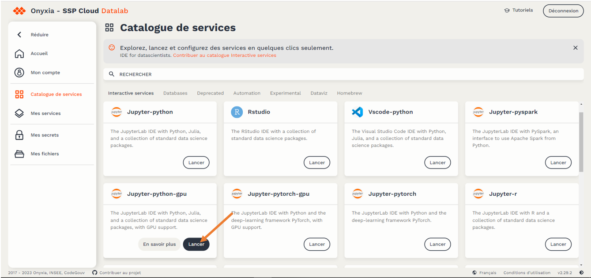

#### 2. Configurer le service

-   Ouvrir le volet de configuration "Configuration Jupyter-python-gpu"

    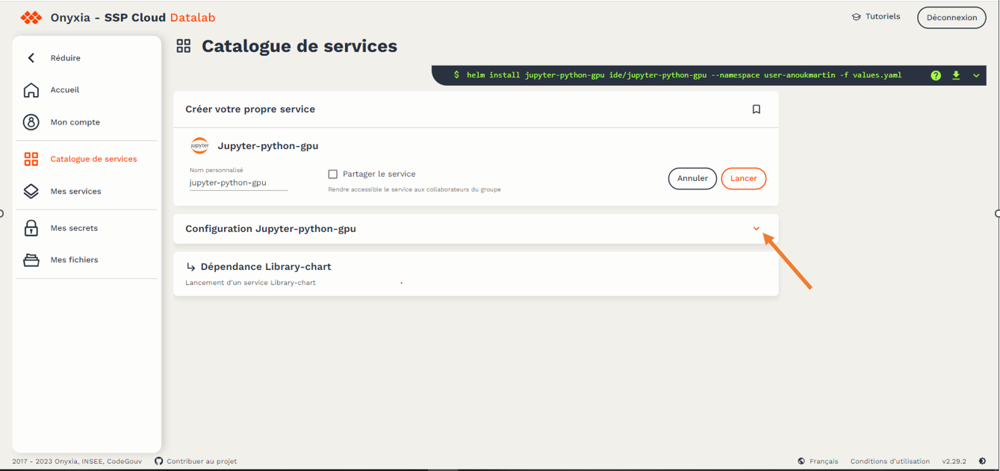

-   Dans l'onglet "Init", remplir le champ "PersonalInit" avec l'adresse suivante : <https://raw.githubusercontent.com/anoukmartin/Transcription-Whisper-x-SSP-Cloud/main/InitPy.sh>

    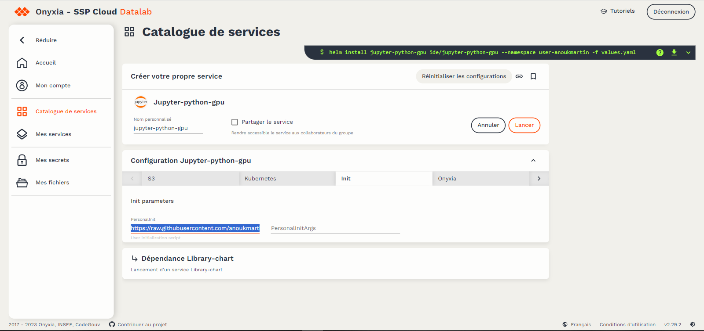

-   Dans l'onglet "Ressources" régler tous les curseurs sur le maximum :

    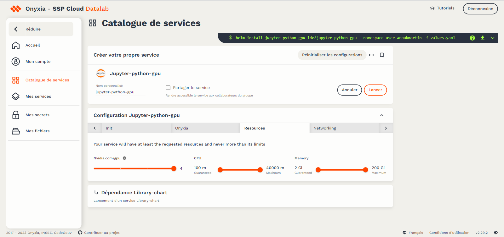

#### 3. Enregistrer cette configuration (pour ne plus avoir à la refaire)

-   Donner un nom à ce service configuré pour Whisper dans le champ "Nom personnalisé". Par exemple "Transcription Whisper".

    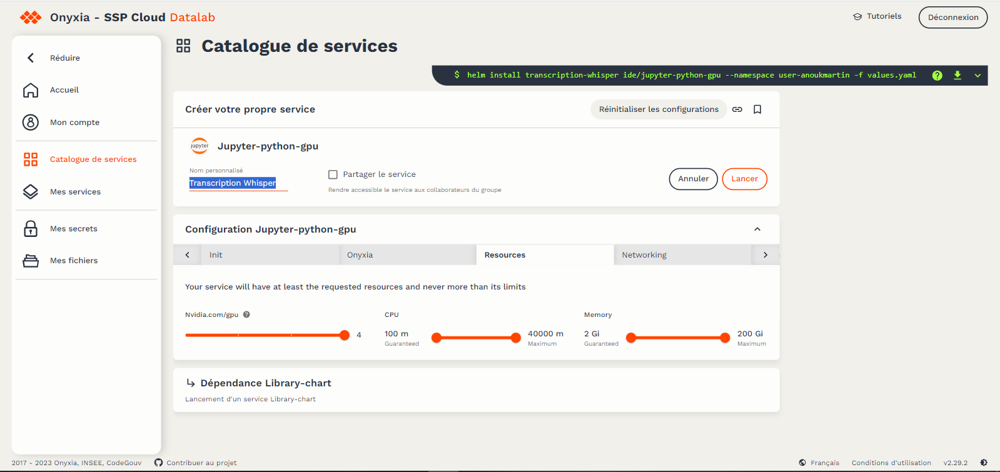

-   Sauvegarder cette configuration : cliquer sur le symbole "enregistrement"

    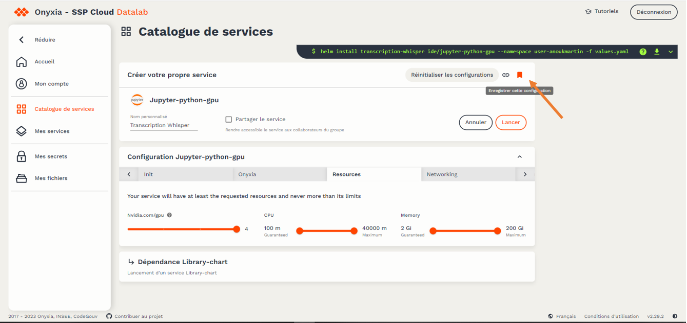

-   Cliquer enfin sur "Lancer" pour sauvegarder définitivement cette configuration et lancer l'ouverture du service

    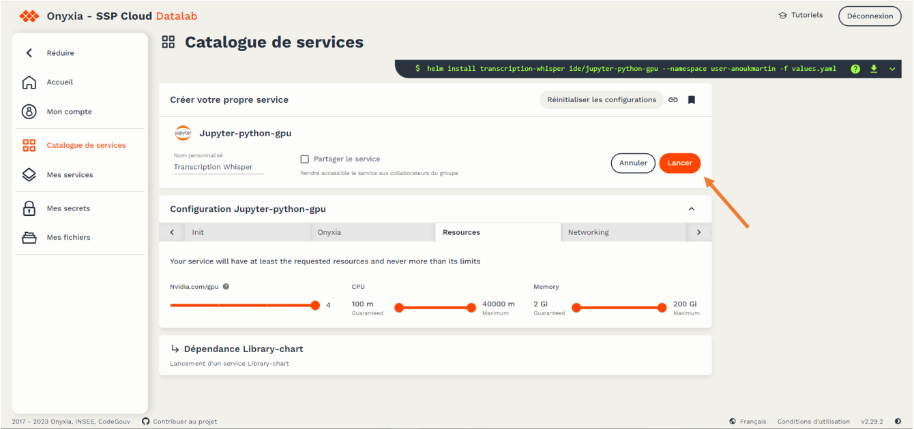

    ⟶ Cette préconfiguration apparaitra désomais dans votre espace "Mes services" comme service enregistré. Il ne sera plus nécéssaire de réaliser toutes les étapes précédentes à chaque fois, vous n'aurez plus qu'a cliquer sur "Lancer" pour lancer Python-Jupyter pré configuré pour la transcription avec Whisper.

#### 4. Ouvrir le service

Une fois le chargement terminé le service (nommé ici "Transcription Whisper") apparaît dans l'onglet "Mes services" comme service en cours.

-   Une fois que ce service est prêt pour l'ouvrir, cliquer sur le bouton 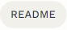{width="67"}. Une boite de dialogue s'ouvre.

-   Cliquer sur {width="231"} puis sur {width="242"}. Une page s'ouvre.

-   Coller le mot de passe dans le champ destiné pour se connecter 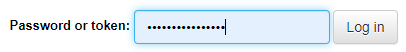{width="234"} .

## Etape 2 : Transcrire un fichier audio

Une fois le service lancé, l'interface Jupyter s'ouvre :

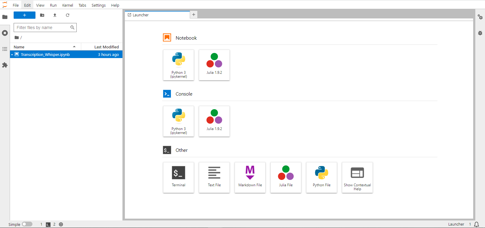

Dans la partie gauche de l'écran, ouvrir le fichier intitulé `Transcription_whisper.ipynb`. Un notebook s'ouvre alors :

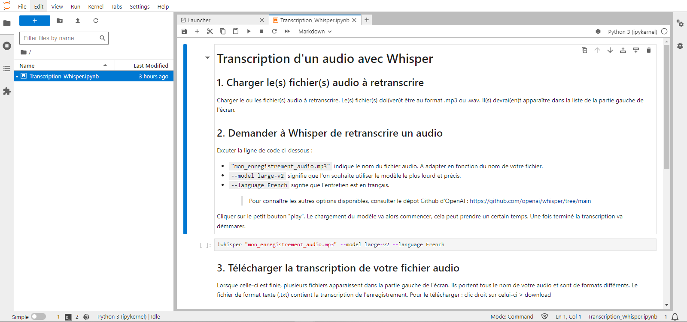

Suivre ainsi les instructions indiquées sur le document.

------------------------------------------------------------------------

### ⟹ *Un exemple avec ["AH LALA" de Meryl](https://www.youtube.com/watch?v=XfIefINb84U&ab_channel=FIYAHRECORDS).*

#### *1.* Installer Whisper

Executer la ligne de code ci-dessous en cliquant sur le bouton  ou avec ctrl + entrer:

``` python
!pip install -U openai-whisper
```

L'installation de Whisper commence :

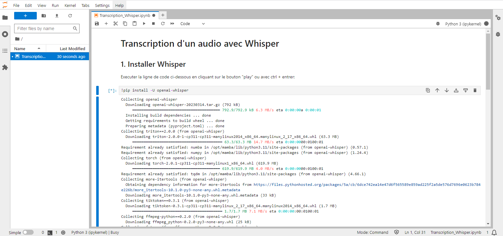

#### *2. Charger le(s) fichier(s) audio à retranscrire*

*Charger le ou les fichier(s) audio à retranscrire en utilisant le bouton {width="36"}. Le(s) fichier(s) doi(ven)t être au format .mp3 ou .wav. Si votre fichier est volumineux ou que vous souhaiter en charger plusieurs, il est préférable de disposer d'une bonne connexion à internet. Il(s) devrai(en)t apparaître dans la liste de la partie gauche de l'écran.*

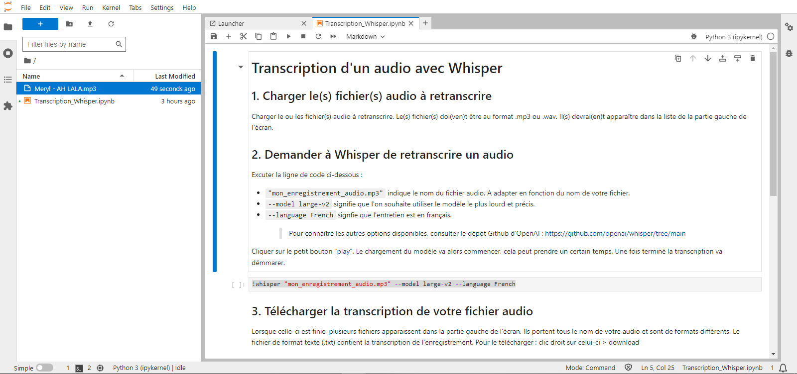

#### *2. Demander à Whisper de retranscrire un audio*

*Exécuter la ligne de code ci-dessous en changeant au besoin ces paramètres (pour connaître les autres options disponibles, consulter le [dépôt Github d'OpenAI](https://github.com/openai/whisper/tree/main)) :*

-   *`"mon_enregistrement_audio.mp3"` indique le nom du fichier audio. A adapter en fonction du nom de votre fichier.*
-   *`--model large-v2` signifie que l'on souhaite utiliser le modèle le plus lourd et précis.*
-   *`--language French` signifie que l'entretien est en français.*

``` python
!whisper "mon_enregistrement_audio.mp3" --model large-v2 --language French
```

*Cliquer sur le petit bouton . Le chargement du modèle va alors commencer, cela peut prendre un certain temps. Une fois terminé la transcription va démarrer :*

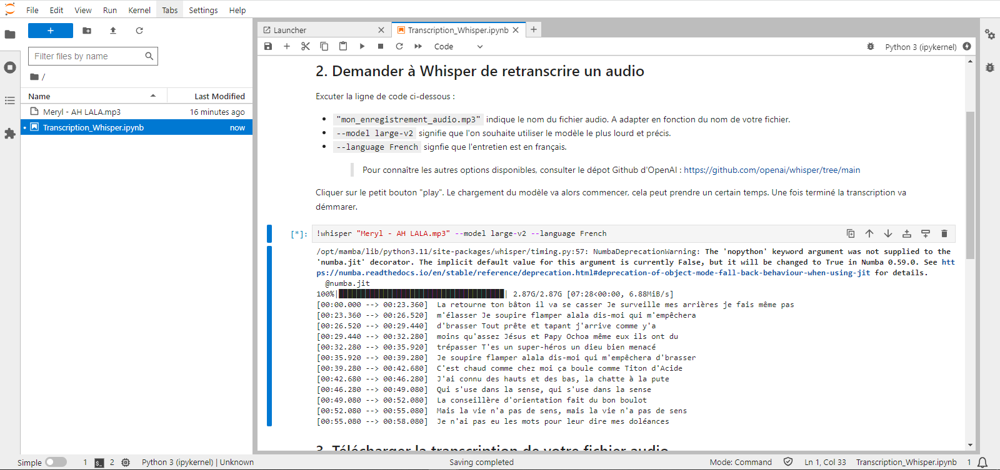

#### *3. Télécharger la transcription de votre fichier audio*

*Lorsque celle-ci est finie, plusieurs fichiers apparaissent dans la partie gauche de l'écran. Ils portent tous le nom de votre audio et sont de formats différents. Le fichier de format texte (.txt) contient la transcription de l'enregistrement. Pour le télécharger : clic droit sur celui-ci \> download*

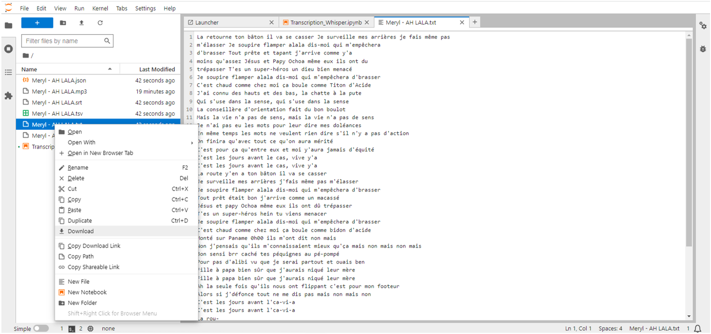

#### *4. Recommencer le point 2. et 3. si vous avez plusieurs fichiers audio à retranscrire*

*Vous pouvez alors répéter ces opérations pour transcrire d'autres fichiers audio.*

------------------------------------------------------------------------

## Etape 3 : Supprimer le service

**La suppression d'un service est automatique 24h après sa création**. Une fois les retranscriptions terminées et les fichiers .txt téléchargés, si vous penser ne plus avoir à transcrire d'entretiens dans les prochaines 24h, il est conseillé de supprimer le service. Cela met en sécurité vos enregistrements audio et leurs transcriptions qui sont alors supprimés du serveur, cela évite également d'encombrer votre espace personnel et les serveurs du SSP.
